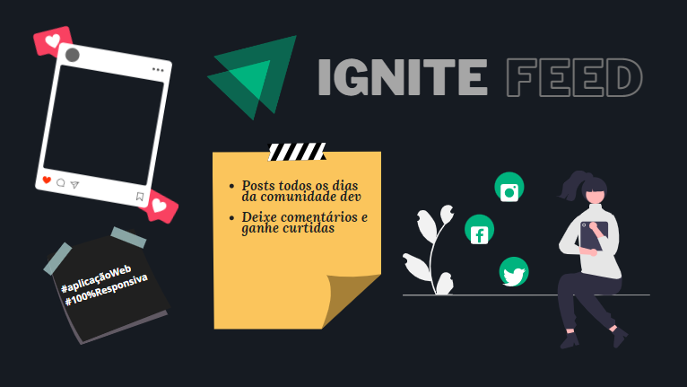
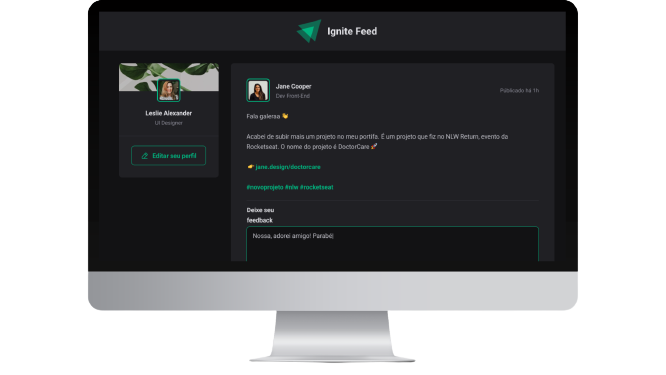

<h1 align="center">
  
</h1>

<br>

<h4 align="center">

    🚧 Ignite Feed 💚
    🚧 Finalizado 🦾
</h4>

<br>

## 💻 Sobre o projeto
O Ignite Feed é um website responsivo criado através das aulas da @rocketseat. O projeto se trata de um feed tradicional de redes sociais que mostra posts, comentários e curtidas. Entretanto, o site foi focado exclusivamente em posts para a comunidade Dev.

---
<br>

## ⚙️ Funcionalidades
- [x] adicionar comentários
- [x] remover comentários
- [x] curtir os comentários

---
<br>

## 🎨 Layout
<div align="center">
  
</div>

---
<br>

## 🚀 Como executar 
```bash
# Clone este repositório
git clone https://github.com/thegabrielrodrigues/ignite-feed.git

# Acesse a pasta do projeto
cd ignite-feed

# Instale o yarn caso não esteja instalado
$ npm install -g yarn

# Instale as dependências
$ yarn install

# Execute a aplicação
$ yarn run dev
```
